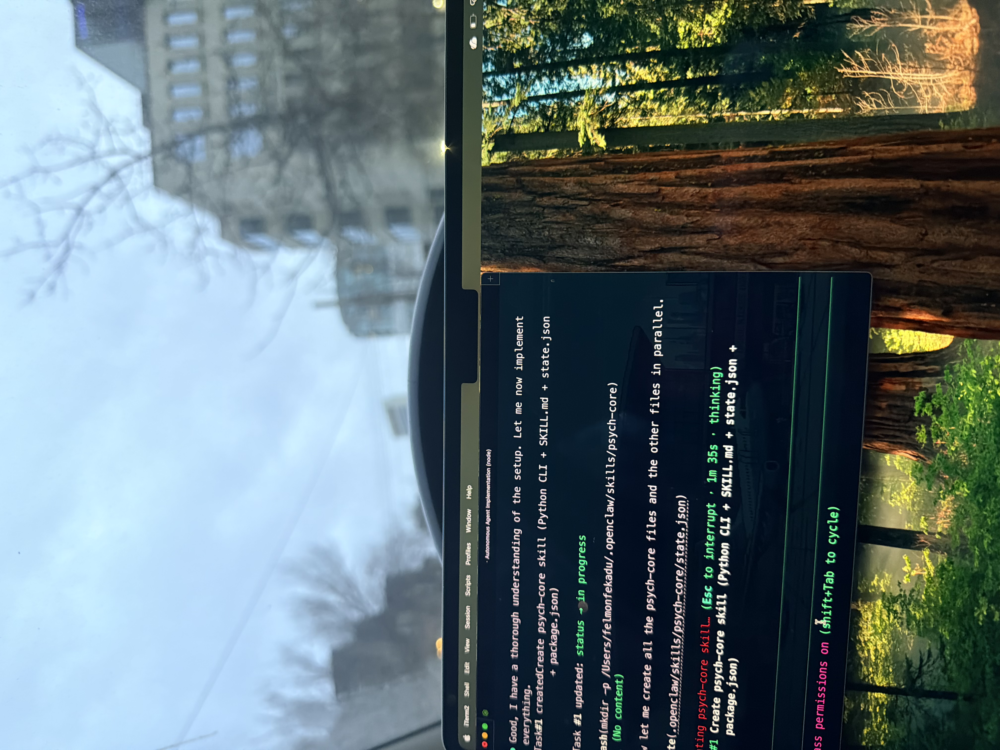

# Felmon Fekadu Portfolio

Engineering portfolio site built to present case-study style project work, open-source contributions, and tailored resume variants in one place.

**Live site:** https://www.felmonfekadu.com/



## What it includes

- Desktop-first portfolio experience with smooth scroll-driven animations
- Case-study sections for flagship products, OSS contributions, and proof of engineering execution
- Tailored resume downloads for SWE, AI/LLM, and public-equities/quant-tech roles
- Contact, experience, and skills sections designed for recruiter and hiring-manager review
- Custom cursor, particle backgrounds, kinetic typography, and glass-card UI components
- Dark/light theme toggle
- CI/CD pipeline with automated tests, lint, and Vercel production deploys on every push to `main`

## Stack

| Layer | Technology |
|---|---|
| Framework | Next.js 14 |
| UI | React 18, Tailwind CSS, Framer Motion |
| Icons | Lucide React |
| Language | TypeScript |
| Testing | Vitest, React Testing Library, jsdom |
| Linting | ESLint (Next.js config) |
| Hosting | Vercel |
| CI/CD | GitHub Actions |

## Project structure

```
app/            Next.js app-router pages and API routes
components/     Page sections (Hero, About, Skills, Projects, Experience, Contact)
components/ui/  Reusable UI primitives (animations, cards, buttons, particles)
lib/            Shared data and utilities
public/         Static assets, images, and resume PDFs
tests/          Test setup
```

## Local development

```bash
npm install
npm run dev
```

Open [http://localhost:3000](http://localhost:3000).

## Scripts

| Command | Description |
|---|---|
| `npm run dev` | Start the development server |
| `npm run build` | Create a production build |
| `npm run start` | Serve the production build |
| `npm run lint` | Run ESLint |
| `npm run test` | Run Vitest test suite |

## Deployment

Every push to `main` triggers the GitHub Actions workflow (`.github/workflows/deploy-production.yml`) which installs dependencies, runs tests and lint, then deploys to Vercel production.

## License

This project is licensed under the [MIT License](LICENSE).
