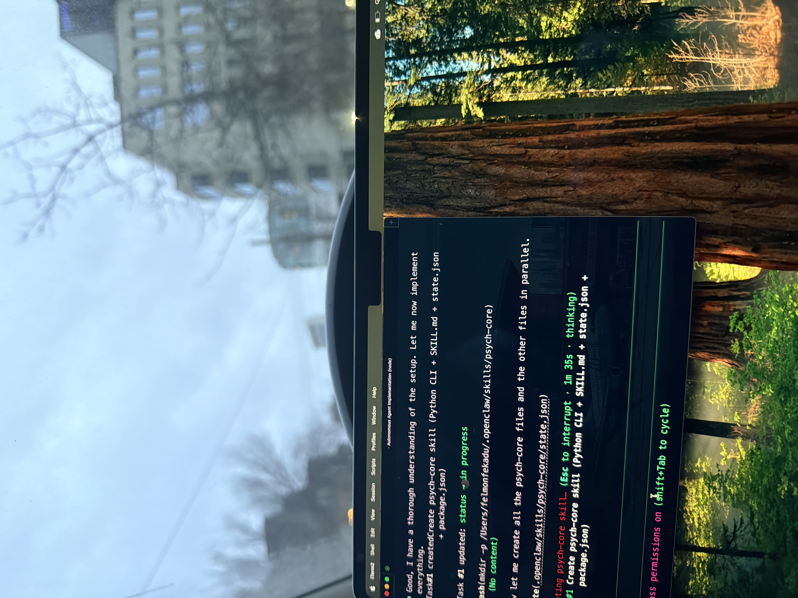

# Felmon Fekadu Portfolio

Engineering portfolio site built to present case-study style project work, open-source contributions, and tailored resume variants in one place.

**Live site:** [felmon.tech](https://felmon.tech)



---

## Engineering Impact

| Project | What I Built |
|---|---|
| **[DocAgent Studio](https://github.com/FelmonFekadu/docagent-studio)** | Local-first RAG engine with verifiable citations, hybrid retrieval, and GraphRAG-style index |
| **[Jungian Typology Assessment](https://github.com/FelmonFekadu/jungian-typology-assessment)** | Full-stack assessment product with Stripe monetization (3-tier pricing), Supabase auth, and Gemini-powered analysis |
| **[CompetencyArcEngine](https://github.com/FelmonFekadu/CompetencyArcEngine)** | Hierarchical multi-agent system with confidence-based routing, homeostasis loops, and morphogenetic memory |
| **[NeuroFlow](https://github.com/FelmonFekadu/neuroflow)** | ADHD-specific productivity app — an external prefrontal cortex with AI task breakdown |

---

## Tech Stack

**Frontend:** React 18, TypeScript, Next.js 14, Tailwind CSS, Framer Motion
**Backend / Services:** Python, Supabase, Stripe
**Tooling:** Vitest, ESLint, GitHub Actions CI/CD, Vercel

---

## Featured Projects

- **[DocAgent Studio](https://github.com/FelmonFekadu/docagent-studio)** — Local-first personal docs assistant (PDF + Notion + Markdown) with citations and MLX LoRA fine-tuning
- **[Jungian Typology Assessment](https://github.com/FelmonFekadu/jungian-typology-assessment)** — Live psychological assessment product with 40-question engine, Stripe billing, and Gemini-powered analysis
- **[CompetencyArcEngine](https://github.com/FelmonFekadu/CompetencyArcEngine)** — Hierarchical multi-agent system inspired by Michael Levin's competency research
- **[NeuroFlow](https://github.com/FelmonFekadu/neuroflow)** — ADHD-specific productivity app built with Next.js 16, React 19, Supabase, and Zustand
- **[AI Speech Coach](https://github.com/FelmonFekadu/ai-speech-coach)** — Real-time AI speech coaching with live video feedback (Tavus CVI, Claude, Next.js)
- **[Collab Editor](https://github.com/FelmonFekadu/collab-editor)** — Real-time collaborative document editor with Next.js, Tiptap, Socket.io, and PostgreSQL
- **[Constitutional Playground](https://github.com/FelmonFekadu/constitutional-playground)** — Interactive playground for Constitutional AI critique-revision loops

---

## What this portfolio includes

- Desktop-first portfolio experience with smooth scroll-driven animations
- Case-study sections for flagship products, OSS contributions, and proof of engineering execution
- Tailored resume downloads for SWE, AI/LLM, and public-equities/quant-tech roles
- Contact, experience, and skills sections designed for recruiter and hiring-manager review
- Custom cursor, particle backgrounds, kinetic typography, and glass-card UI components
- Dark/light theme toggle
- CI/CD pipeline with automated tests, lint, and Vercel production deploys on every push to `main`

## Stack Details

| Layer | Technology |
|---|---|
| Framework | Next.js 14 |
| UI | React 18, Tailwind CSS, Framer Motion |
| Icons | Lucide React |
| Language | TypeScript |
| Testing | Vitest, React Testing Library, jsdom |
| Linting | ESLint (Next.js config) |
| Hosting | Vercel |
| CI/CD | GitHub Actions |

## Project structure

```
app/            Next.js app-router pages and API routes
components/     Page sections (Hero, About, Skills, Projects, Experience, Contact)
components/ui/  Reusable UI primitives (animations, cards, buttons, particles)
lib/            Shared data and utilities
public/         Static assets, images, and resume PDFs
tests/          Test setup
```

## Local development

```bash
npm install
npm run dev
```

Open [http://localhost:3000](http://localhost:3000).

## Scripts

| Command | Description |
|---|---|
| `npm run dev` | Start the development server |
| `npm run build` | Create a production build |
| `npm run start` | Serve the production build |
| `npm run lint` | Run ESLint |
| `npm run test` | Run Vitest test suite |

## Deployment

Every push to `main` triggers the GitHub Actions workflow (`.github/workflows/deploy-production.yml`) which installs dependencies, runs tests and lint, then deploys to Vercel production.

## License

This project is licensed under the [MIT License](LICENSE).
